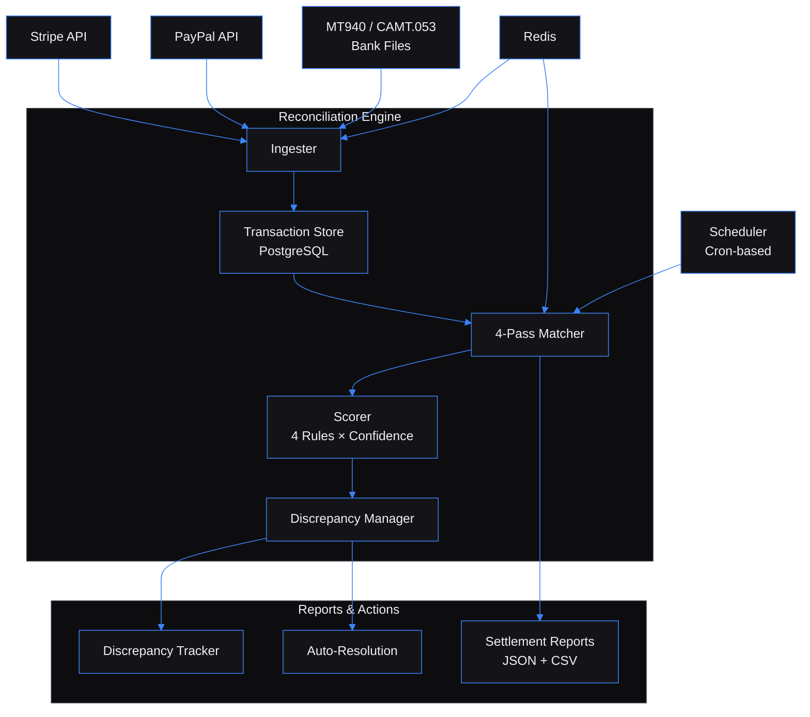

# Transaction Reconciliation Engine — Automated payment matching across gateways, banks, and ledgers

Built by [Kingsley Onoh](https://kingsleyonoh.com) · Systems Architect

## The Problem

Any company processing payments through Stripe, PayPal, or bank transfers deals with the same headache: money moves through multiple systems, and the records never quite match. A refund shows up in the gateway but not the bank. A payment arrives three days late with a different reference number. A fee gets deducted that nobody expected. Finance teams spend hours in Excel every week reconciling these discrepancies — and for regulated businesses, auditors demand proof that every cent is accounted for. At scale (10,000+ transactions/day), manual reconciliation breaks down entirely.

## Architecture



## Key Decisions

- **I chose Go over Python/Node** because reconciliation is CPU-bound comparison work. The 4-pass matching cascade evaluates every gateway transaction against every unmatched ledger entry — with 4,000 transactions, that's millions of comparisons. Go compiles to native code and handles this in under 5 seconds where Python would take 30–60+.
- **I chose raw SQL (sqlx) over an ORM** because every query in a reconciliation engine is performance-critical. ORMs generate unpredictable queries, and when you're inserting 5,000 transactions in a batch or joining matches against discrepancies, you need to control the SQL exactly.
- **I chose integer cents over floating-point amounts** because `$19.99` as `1999` cents eliminates an entire class of rounding bugs. Financial software that uses `float64` for money is broken by design.
- **I chose a 4-rule scoring cascade over a single matching algorithm** because real-world transactions match in different ways. Exact matches (confidence 1.0) are obvious, but a bank entry arriving 2 days late needs fuzzy date matching (0.90), a reference number embedded in a description needs reference matching (0.80), and a payment with a 0.3% fee difference needs fuzzy amount matching (0.75). Each rule produces a confidence score; the scorer picks the best.
- **I chose Redis distributed locks over database locks** because reconciliation runs must be mutually exclusive across multiple instances. A Redis lock with TTL auto-expires if a process crashes, and the lock key is simple (`reconcile:lock`). Database advisory locks don't survive connection drops cleanly.

## How the Matching Works

The reconciler runs a 4-pass cascade, evaluating each gateway transaction against all unmatched ledger entries:

| Pass | Rule | Confidence | What it Matches |
|------|------|-----------|-----------------|
| 1 | Exact | 1.00 | Same amount, currency, date, and counterparty |
| 2 | Amount + Date | 0.90 | Same amount, date within tolerance (default: 3 days) |
| 3 | Reference | 0.80 | External ID found in the other transaction's description |
| 4 | Fuzzy Amount | 0.75 | Amount within tolerance (default: 0.5%), date within tolerance |

Transactions that match above the `MIN_CONFIDENCE_THRESHOLD` (default: 0.70) are recorded. Unmatched transactions become discrepancies, classified by severity based on the amount involved.

## Setup

### Prerequisites

- Go 1.22+
- Docker & Docker Compose
- PostgreSQL 16 (provided via Docker)
- Redis 7 (provided via Docker)

### Installation

```bash
git clone https://github.com/kingsleyonoh/Transaction-Reconciliation-Engine.git
cd Transaction-Reconciliation-Engine
go mod download
```

### Environment

```bash
cp .env.example .env
```

| Variable | Purpose |
|----------|---------|
| `PORT` | HTTP server port (default: `8080`) |
| `API_KEY` | API authentication key |
| `DATABASE_URL` | PostgreSQL connection string |
| `REDIS_URL` | Redis connection string |
| `USE_FIXTURES` | `true` = recorded fixtures for CI/tests, `false` = live API calls |
| `STRIPE_SECRET_KEY` | Stripe API key (`sk_test_` for sandbox) |
| `PAYPAL_CLIENT_ID` | PayPal OAuth client ID |
| `PAYPAL_CLIENT_SECRET` | PayPal OAuth client secret |
| `FUZZY_AMOUNT_TOLERANCE` | Amount match tolerance (default: `0.005` = 0.5%) |
| `FUZZY_DATE_TOLERANCE_DAYS` | Date match tolerance in days (default: `3`) |
| `MIN_CONFIDENCE_THRESHOLD` | Minimum score to accept a match (default: `0.70`) |
| `RECONCILE_SCHEDULE` | Cron expression for auto-reconciliation (default: `0 2 * * *`) |
| `HIGH_SEVERITY_THRESHOLD_CENTS` | Amount threshold for high-severity discrepancies (default: `10000`) |
| `CRITICAL_SEVERITY_THRESHOLD_CENTS` | Amount threshold for critical-severity discrepancies (default: `100000`) |

### Run

```bash
# Docker (recommended)
docker compose up --build -d

# Apply migrations
make migrate-up

# Or run directly
go build -o recon ./cmd/recon && ./recon serve
```

## API Endpoints

All authenticated endpoints require `X-API-Key` header.

| Method | Endpoint | Auth | Description |
|--------|----------|------|-------------|
| `GET` | `/api/v1/health` | No | Health check (DB + Redis status) |
| `POST` | `/api/v1/transactions/ingest` | Yes | Ingest a single transaction |
| `POST` | `/api/v1/transactions/ingest/batch` | Yes | Batch ingest (up to 1,000 per request) |
| `POST` | `/api/v1/files/upload` | Yes | Upload MT940/CAMT.053 bank file |
| `POST` | `/api/v1/reconcile` | Yes | Trigger reconciliation run |
| `GET` | `/api/v1/reconcile/{runID}` | Yes | Get reconciliation run details |
| `GET` | `/api/v1/reconcile/history` | Yes | List reconciliation run history |
| `GET` | `/api/v1/discrepancies` | Yes | List discrepancies (filterable by status) |
| `PATCH` | `/api/v1/discrepancies/{id}` | Yes | Update discrepancy status |
| `GET` | `/api/v1/reports/settlement` | Yes | Generate settlement report |
| `GET` | `/api/v1/reports/discrepancies` | Yes | Generate discrepancy report |

## Usage

```bash
# Ingest a single transaction
curl -X POST http://localhost:8080/api/v1/transactions/ingest \
  -H "X-API-Key: $API_KEY" \
  -H "Content-Type: application/json" \
  -d '{"source_id":"...","external_id":"txn_001","amount":9999,"currency":"USD","direction":"credit","counterparty":"Acme Corp","occurred_at":"2026-03-15T10:00:00Z"}'

# Batch ingest
curl -X POST http://localhost:8080/api/v1/transactions/ingest/batch \
  -H "X-API-Key: $API_KEY" \
  -H "Content-Type: application/json" \
  -d '{"transactions":[...]}'

# Upload MT940 bank file
curl -X POST http://localhost:8080/api/v1/files/upload \
  -H "X-API-Key: $API_KEY" \
  -F "file=@statement.mt940" -F "source_id=..."

# Trigger reconciliation
curl -X POST http://localhost:8080/api/v1/reconcile \
  -H "X-API-Key: $API_KEY" \
  -H "Content-Type: application/json" \
  -d '{"date_from":"2026-03-01T00:00:00Z","date_to":"2026-03-31T23:59:59Z","source_ids":["gateway-uuid","ledger-uuid"]}'

# List open discrepancies
curl http://localhost:8080/api/v1/discrepancies?status=open \
  -H "X-API-Key: $API_KEY"

# Generate settlement report
curl http://localhost:8080/api/v1/reports/settlement?format=csv \
  -H "X-API-Key: $API_KEY"
```

### CLI Commands

```bash
recon serve                                          # Start HTTP server
recon sync stripe|paypal                             # Manually trigger source sync
recon upload <file>                                  # Ingest a bank statement file
recon reconcile --from 2026-03-01 --to 2026-03-31   # Run reconciliation
recon report --type settlement --from ... --to ...   # Generate report (JSON/CSV)
recon discrepancies --status open --limit 25         # List discrepancies
```

## Tests

```bash
# Unit tests
go test ./internal/... -count=1 -v

# Unit tests with race detection
go test ./internal/... -count=1 -v -race

# PRD validation suite (requires Docker stack running)
docker compose up --build -d
go test -v -timeout 300s -run TestPRD ./tests/
```

The PRD validation suite runs 8 criteria against a live Docker stack with synthetic data:

| Criterion | What it Tests | Threshold |
|-----------|---------------|-----------|
| Batch Ingest | 5,000 transactions + idempotency | < 30s |
| MT940 Parsing | Multi-record SWIFT bank file | 0 errors |
| Reconciliation | 4,000 txn matching performance | < 60s |
| Match Rate | Exact + fuzzy match accuracy | ≥ 85% |
| Fuzzy Matching | Date/amount tolerance detection | > 0 fuzzy matches |
| Discrepancies | Unmatched transaction flagging | > 0 records |
| Auto-Resolution | Discrepancy lifecycle on re-run | Status = resolved |
| Settlement CSV | Report generation | Valid CSV output |

## Deployment

Live at **[recon-engine.kingsleyonoh.com](https://recon-engine.kingsleyonoh.com)**.

The production stack runs on a DigitalOcean VPS behind Traefik v3.6 with automatic HTTPS via Let's Encrypt:

- **App:** Multi-stage Docker build → GHCR (`ghcr.io/kingsleyonoh/recon-engine:latest`)
- **Database:** PostgreSQL 16 Alpine with persistent volume
- **Cache/Lock:** Redis 7 Alpine with AOF persistence
- **Reverse Proxy:** Traefik v3.6 with automatic TLS
- **Auto-Deploy:** Watchtower polls GHCR every 5 minutes

### Deploy Updates

```powershell
# Build and push from local machine — Watchtower handles the rest
.\build-and-push.ps1
```

---

> **Live Demo:** [https://recon-engine.kingsleyonoh.com](https://recon-engine.kingsleyonoh.com)
>
> This is a live demo with usage limits. For full access or a custom build, [get in touch](https://kingsleyonoh.com).

<!-- THEATRE_LINK -->

📐 **[Full case study on kingsleyonoh.com](https://www.kingsleyonoh.com/projects/transaction-reconciliation-engine-foundry)**
